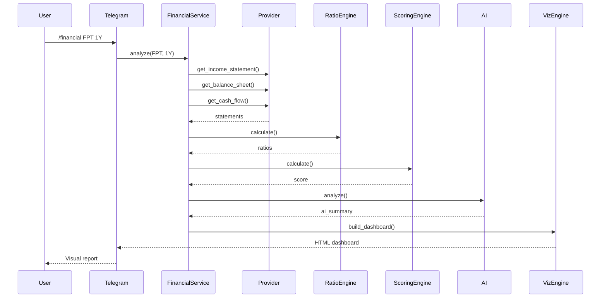

# Financial Analysis Engine

## Overview

The Financial Analysis Engine extends StockTrace with comprehensive financial statement analysis, ratio calculation, scoring, valuation, AI insights, and visual dashboards for Vietnamese stocks.

## Architecture

```text
Telegram/API
     |
     v
Financial CQRS Handlers
     |
     v
FinancialAnalysisService (Orchestrator)
     |
     +-- FinancialProvider (Composite: VNStock → Mock)
     +-- FinancialRatioEngine
     +-- FinancialScoringEngine
     +-- ValuationEngine
     +-- FinancialSignalEngine
     +-- AIFinancialAnalysisService
     +-- FinancialVisualizationEngine
     |
     v
FinancialDashboard (JSON + ASCII charts + Telegram HTML)
```

## Folder Structure

```text
src/stocktrace/
├── domain/
│   ├── entities/financial.py          # Domain entities
│   ├── ports/financial_provider.py    # Provider port
│   ├── repositories/financial.py      # Repository ports
│   └── value_objects/financial_period.py
├── application/
│   ├── services/financial/
│   │   ├── ratio_engine.py
│   │   ├── scoring_engine.py
│   │   ├── valuation_engine.py
│   │   ├── signal_engine.py
│   │   ├── visualization_engine.py
│   │   ├── ai_financial_analysis_service.py
│   │   └── financial_analysis_service.py
│   └── queries/
│       ├── financial_queries.py
│       └── financial_handlers.py
├── infrastructure/
│   ├── providers/financial/
│   │   ├── mock_provider.py
│   │   ├── vnstock_provider.py
│   │   └── composite.py
│   ├── db/models/financial.py
│   └── scheduler/financial_job.py
├── ai/
│   ├── financial_models.py
│   └── financial_prompt_builder.py
└── api/
    ├── routers/financial.py
    └── schemas/financial.py
```

## Telegram Commands

| Command | Description |
|---------|-------------|
| `/financial SYMBOL PERIOD` | Full visual dashboard (e.g. `/financial FPT 1Y`) |
| `/report SYMBOL` | Financial report (1Y default) |
| `/valuation SYMBOL` | Valuation analysis |
| `/score SYMBOL` | Financial health score |
| `/roe SYMBOL` | ROE-focused analysis |
| `/debt SYMBOL` | Debt analysis |
| `/cashflow SYMBOL` | Cash flow analysis |
| `/compare SYMBOL1 SYMBOL2` | Compare two stocks |

## API Endpoints

| Method | Path | Description |
|--------|------|-------------|
| GET | `/api/v1/financial/{ticker}/analysis?period=1Y` | Full dashboard |
| GET | `/api/v1/financial/{ticker}/report` | Financial report |
| GET | `/api/v1/financial/{ticker}/valuation` | Valuation |
| GET | `/api/v1/financial/{ticker}/score` | Score only |
| GET | `/api/v1/financial/compare/{a}/{b}` | Compare |

## Scoring Model

| Category | Weight |
|----------|--------|
| Growth | 30% |
| Profitability | 25% |
| Debt | 15% |
| Cash Flow | 15% |
| Valuation | 15% |

| Score | Recommendation |
|-------|----------------|
| 0-2 | Strong Sell |
| 3-4 | Sell |
| 5-6 | Hold |
| 7-8 | Buy |
| 9-10 | Strong Buy |

## Scheduler Jobs

| Schedule | Job |
|----------|-----|
| Weekly (Sun 02:00) | Financial statement sync |
| Monthly (1st 03:00) | Valuation recalculation |
| Quarterly (15th) | Full report refresh |

## Trace Types

- `TRACE_FINANCIAL` — Profitability signals
- `TRACE_VALUATION` — PE/PB alerts
- `TRACE_CASHFLOW` — Cash flow signals
- `TRACE_DEBT` — Debt ratio alerts
- `TRACE_GROWTH` — Revenue/profit growth
- `TRACE_RISK` — Composite risk signals

## Sequence Diagram



## Future Scalability

1. **Provider integration** — Wire VNStock, TCBS, Vietstock, CafeF, FiinTrade APIs
2. **Caching** — Redis cache for financial statements (TTL: 24h)
3. **Persistence** — Save analyses to PostgreSQL via repository adapters
4. **Web dashboard** — React widgets consuming JSON chart metadata
5. **Real chart rendering** — matplotlib/plotly PNG generation for Telegram
6. **Sector benchmarks** — Compare ratios against industry averages
7. **Event streaming** — Publish financial alerts to Kafka/Redis streams

## Database Tables

- `financial_statements` — Raw statement snapshots
- `financial_ratios` — Calculated ratios
- `financial_scores` — Health scores
- `financial_analysis` — Full analysis reports
- `valuation_history` — PE/PB history
- `financial_alerts` — Triggered signals

Run migration: `make migrate` or `uv run alembic upgrade head`
